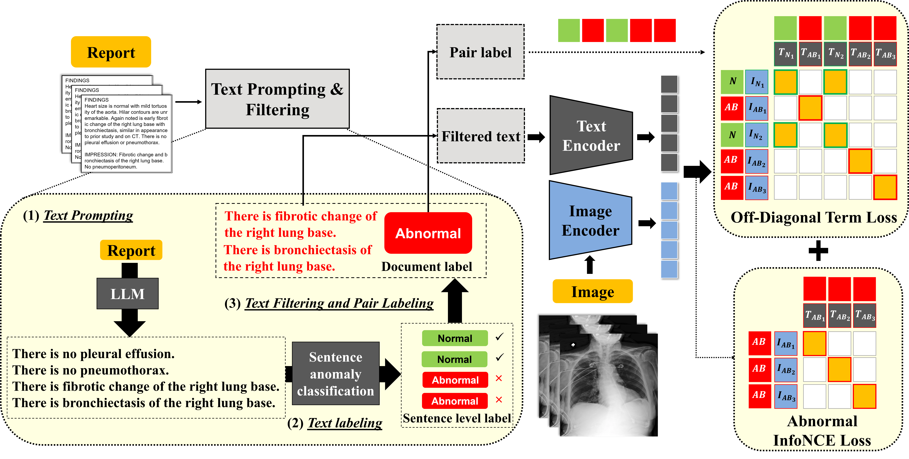

# OFF-CLIP: Improving Normal Detection Confidence in Radiology CLIP with Simple Off-Diagonal Term Auto-Adjustment

Official code for **OFF-CLIP: Improving Normal Detection Confidence in Radiology CLIP with Simple Off-Diagonal Term Auto-Adjustment**, accepted at **MICCAI 2025 (Early Accept, top 9%)**.



---

## About

**OFF-CLIP** (**OFF**-Diagonal Term Auto-Adjustment for **C**ontrastive **L**anguage-**I**mage **P**re-Training) is a novel contrastive learning framework designed to improve medical image–text alignment.

Key contributions:
- **Off-diagonal term loss**: Encourages tight clustering of normal samples in the embedding space.
- **Text filtering strategy**: Removes normal sentences from abnormal reports to reduce both **false positives** and **false negatives**.
- Outperforms the **CARZero** baseline in zero-shot classification and anomaly localization.

---

## 📊 Datasets

OFF-CLIP is trained and evaluated using the following datasets:

### 🔹 Training Dataset
- **MIMIC-CXR** ([Link](https://physionet.org/content/mimic-cxr/2.0.0/))  
  - 377,110 frontal-view chest radiographs with reports  
  - One frontal image is randomly selected per study  
  - One prompted sentence selected per epoch  
  - Training restricted to images from folders `p10` to `p16` (within `p10`–`p19`)

### 🔹 Evaluation Datasets
- **VinDr-CXR** ([Link](https://physionet.org/content/vindr-cxr/1.0.0/))  
  - 18,000 images (3,000 for evaluation, 68.3% normal), 28 bounding-box disease annotations  
- **Open-I** ([Link](https://openi.nlm.nih.gov/faq))  
  - 7,470 images, 18 disease annotations  
- **CheXpert** ([Link](https://stanfordaimi.azurewebsites.net/datasets/23c56a0d-15de-405b-87c8-99c30138950c))  
  - 224,316 images, 14 disease labels (evaluation on 500 cases)  
- **PadChest** ([Link](http://bimcv.cipf.es/bimcv-projects/padchest/))  
  - 160,868 images, 192 disease labels (evaluation on 39,053 manually labeled cases)

---

## ⚙️ Setup

Install dependencies:

```bash
pip install -r requirements.txt
```

---

## 🚀 Training

🔒 **Training loss code will be released after the final acceptance notification.**

For sentence-level anomaly filtering, we use a pretrained sentence-level anomaly classifier:

👉 [Download the model](https://drive.google.com/file/d/1QuRSJBnaj5Plj_XAxRE8XsyjESLyS9wb/view?usp=drive_link)

This classifier is used to exclude normal sentences from abnormal reports before contrastive learning.

---

## ✅ Validation

### Pretrained OFF-CLIP Checkpoint

To evaluate performance, download the best-performing OFF-CLIP checkpoint:  
👉 [OFF-CLIP Checkpoint](https://drive.google.com/file/d/1JmfB2jbl-58aBrxRwaMrGjhPNUUjKNC-/view?usp=drive_link)

This checkpoint includes:
- Off-diagonal term loss  
- Abnormal InfoNCE loss  
- Sentence-level filtering of normal text

---

### Run Zero-Shot Classification

To run zero-shot classification on multi-label datasets:

```bash
python3 validation.py \
  --weight_path {path_to_checkpoint} \
  --save_name {output_name} \
  -c configs/offclip.yaml
```

Results will include similarity scores and classification metrics across all test datasets.

```
